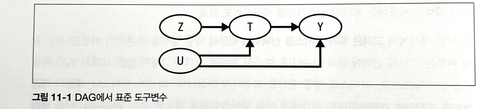
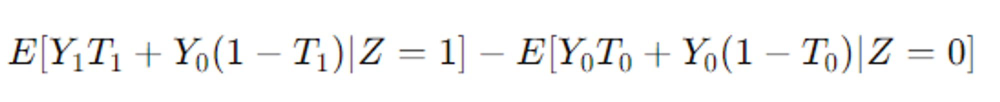
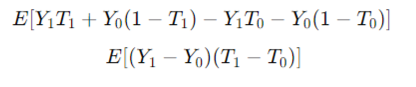
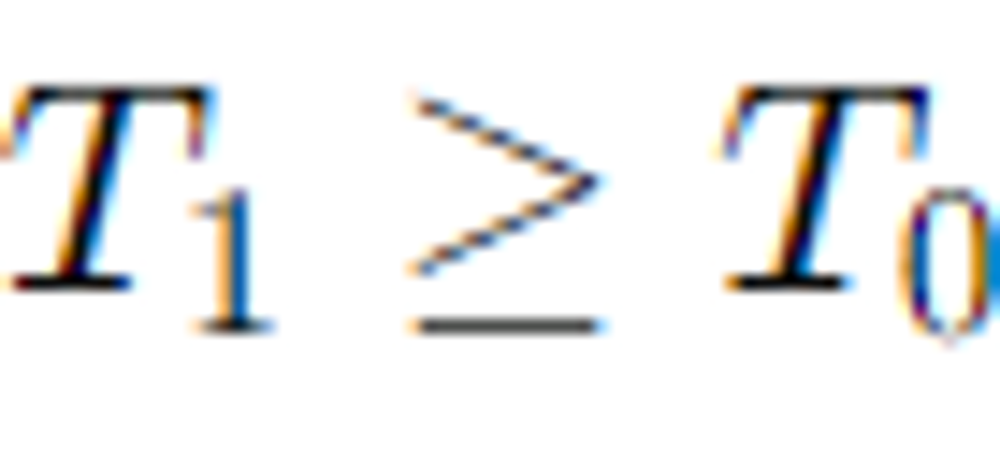

# Chapter 11.1-11.6 불응과 도구변수

작성자 : 하소희

# 개념

## 불응

- 요구나 요청에 응하지 않음
- 처치를 배정 받은 모든 사람이 처치 받지 않음을 의미
    - 즉, 처치가 배정되었다고 처치가 반드시 적용되지 않을 수 있음을 의미
- 처치 여부를 무작위로 결정하더라도 고객이 이를 선택할 수 있는 상황에서 발생

## 도구변수

- 불응과 같은 문제에서 처치가 결과에 미치는 인과 효과를 정확히 추정하기 위한 방법
- 도구변수는 처치와 관련이 있고 결과 변수와 직접적인 관련이 없어야 함

## 처치 배정과 처치 적용에 따른 4가지 그룹

- 순응자: 자신에게 배정된 처치 받는 사람
- 항시 참여자: 배정과 관계 없이 항상 처치 받는 사람
- 항시 불참자: 배정과 관계없이 처치를 한 번도 받지 않은 사람
- 반항자: 배정된 처치와 반대되는 처치 받는 사람

# 불응 DAG

- Z : 도구변수
    - 1) 교란 없이 처치에 영향을 주고
    - 2) 처치를 거치지 않으면 결과에 영향을 미치지 않는 변수
- T : 처치
- Y : 결과
- U : 교란요인

---

**불응에서 처치에 따른 효과를 정확히 판단할 수 없음**

: U를 통과하는 **열린 뒷문 경로** 때문에 처치가 Y에 미치는 영향을 제대로 식별할 수 없기 때문

- 열린 뒷문 경로 → 처치와 결과가 공통 원인을 공유하는 상황(U)

# 불응 예시

<aside>
💡 예시
1️⃣고객을 대상으로 프라임 신용카드 이용 가능 여부를 무작위로 배정

2️⃣고객의 절반은 실험군, 나머지 절반은 대조군

3️⃣카드 이용 선택은 고객 몫 → 불응 존재

알고 싶은 것 → 프라임 카드 사용이 고객의 구매금액을 얼마나 늘리는가?

</aside>

- Z : 프라임 신용카드 이용 가능 여부(무작위배정)
- T : 프라임 카드 보유 여부
- Y : 구매금액
- U : 교란요인

## ITTE ↔ ATE 비교

### 처치 의도 효과(ITTE)

- Z는 무작위로 배정되기 때문에(예시에서) 단순 선형회귀로 추정가능

$$
ITTE = E[Y|Z =1]-E[Y|Z = 0] = E[Y_1,_t - Y_0,_t]
$$

✅그러나 ITTE가 처치효과와 같다고 말할 수 없음

✅실제 처치를 받지 않은 대상자가 포함되기 때문에, 처치의 실제 효과를 과소평가할 수 있음

✅중요한 건 카드 선택(처치 받은 대상자)에 따른 처치효과를 파악하는 것

### ITTE ↔ ATE 차이

- **ITTE**: 모든 배정된 대상을 포함하므로 실제 효과를 과소평가할 수 있음
- **ATE**: 실제로 처치를 받은 대상자만 포함하여 더 정확한 처치 효과를 반영

✅ 따라서, 불응이 발생하면(무작위 처치 배정과 상관없이) 처치를 받은 사람과 받지 않은 사람이 혼재되어 있기 때문에 **ITTE** 추정값이 처치의 실제 효과를 과소평가하게 됨

✅ ITTE 추정값은 ATE 추정값보다 0에 가깝게 편향됨(처치의 효과가 0에 가까워짐을 의미)

### 처치 선택에 따른 ATE 식별 불가

- 불응 상태에서는 처치 선택이 무작위가 아니므로, 처치 받은 경우와 받지 않은 경우를 비교해도  ATE를 제대로 식별할 수 없음

✅ ITTE의 값은 대리 변수로 사용할 수 있지만, 처치의 실제 효과를 과소평가 하게 됨

✅ 처치 선택이 무작위가 아니기에 ATE를 제대로 식별할 수 없음

→ 추가적인 가정 필요

# 도구변수 식별 가정

**ITTE 에서 출발**

## 1. 연관성

- 도구변수가 처치변수에 영향을 미쳐야 함

## 2. 배제 제약

- 처치 T를 통하지 않고는 Z에서 Y로 가는 경로가 없다는 가정
- 도구변수가 처치를 통해서만 결과에 영향을 미침
- $Y_z,_t = Y_t$

## 3. 독립성

- Z와 T 그리고 Z와 Y 사이에 측정되지않은 교란요인이 없다고 가정
- 도구변수가 무작위로 배정된것처럼 작용

## 4. 단조성

- 도구변수가 처치변수를 한 방향으로만 영향을 주는 것을 의미

- 참고
    
    $T_1>T_0$인 값을 갖는 그룹은 순응자 밖에 없음
    
    - 순응자(Complier) : 배정된 처치를 받는 사람들(T1=1, T0 = 0)
    - 항시 참여자 (Always-taker): 도구변수와 상관없이 항상 처치를 받는 사람들 (T1=1, T0=1).
    - 항시 불참자자 (Never-taker): 도구변수와 상관없이 처치를 받지 않는 사람들 (T1=0, T0=0).
    - 반항자 (Defier): 도구변수의 할당과 반대로 행동하는 사람들 (T1=0, T0=1).
        
        

### 결과

<aside>
💡 도구 변수가 결과에 미치는 영향을,
도구 변수가 처치에 미치는 영향인 순응률로 조정함으로써,
순응자들에 대한 평균 처치효과를 식별할 수 있음(**국지적 평균 처치 효과 LATE**)

</aside>

$$
E[Y_1-Y_0|T_1>T_0] = \frac{E[Y|Z=1]-E[Y|Z=0]}{E[T|Z=1]-E[T|Z=0]}
$$

## 도구변수 실습

### 1단계

- 1단계 - 회귀: 처치 변수를 도구변수에 대해 회귀하는 단계 → 연관성 가정 확인 가능
- 도구변수와 관련된 매개변수 추정값이 크고 통계적으로 유의 → 해당 가정이 유효
- Z → T 추정

### 2단계

- 2단계 - 축약형 : 결과를 도구변수에 회귀하여 처치 의도 효과를 추정
- Z → Y 추정

LATE = 2단계 추정값 / 1단계 추정값

# 2단계 최소제곱법

- 개념
    - 2단계에서 결과(Y)를  1단계에서 구한 T의 예측값($\hat{T}$)에 회귀하는 방법
- 장점
    - 표준오차를 적절하게 계산할 수 있음
    - 더 많은 도구변수와 공변량을 추가할 수 있음