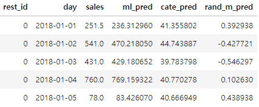

# Chapter 6. 이질적 처치효과

작성자 : 하소희

# Overview

- 지금까지는 그룹에 처치를 적용했을 때 **평균적인** 영향에 대해 살펴봄(ATE)
- 그러나 실험 대상마다 처치효과는 각각 다를 수 있음
- 이를 “**이질적 처치효과**” 라고 함

# Highlights

- 평균 처치효과 추정(ATE)에서 조건부 평균 처치효과(CATE)를 추정하는 방법
- 조건부 평균 처치효과(CATE) 평가하는 방법
    - 분위수별 효과곡선
    - 누적 효과 곡선
    - 누적 이득 곡선
    - 목표 변환
- 의사결정을 위한 조건부 평균 처치효과(CATE)

# ATE → CATE

### ATE

- 처치의 평균적인 효과
- 어떻게 하면 ATE를 더 잘 추정할 수 있는지에 초점
- 처치 대상을 선별하는 것이 아닌 전체 모집단에 처치를 하고 그 처치의 평균적인 효과를 구함

### CATE

- **누구에게 처치해야 하는지를 고려**하여 처치 효과를 구하는 것에 초점

$$
\tau=E[Y_1-Y_0]
$$

$$
\tau=E[Y_1-Y_0|X]
$$

- $X$에 대한 조건부는 공변량$X$로 정의된 대상 특성에 따라 처치효과가 다를 수 있다는 것을 의미

# CATE with Regression

- How?
    - 공변량과 처치의 상호작용 항을 회귀식에 포함
- 효과
    - 처치반응 함수의 기울기
    - $\frac {\Delta Y} {\Delta T}$

### ATE

- $y_i = \beta_0 +\beta_1t_i + \beta_2X_i + e_i$
- $\frac {\delta y_i} {\delta t_i} = \beta_1$
- 처치가 무작위 배정되었다면 처치에 대해 미분한 해당 회귀계수가 ATE

### CATE

- $y_i = \beta_0 +\beta_1t_i + \beta_2X_i + \beta_3t_iX_i+e_i$
- $\frac {\delta \hat y_i} {\delta t_i} = \hat\beta_1 + \hat\beta_3X_i$
    - $\frac {\delta \hat y_i} {\delta t_i} \approx \hat y(t+1) - \hat y(t)$ (도함수 정의 이용)
- 각각 다른 $X_i$로 정의된 개별 대상마다 기울기 예측값이 다름
- 즉, X가 변함에 따라 기울기 예측값도 변함

# CATE Predictions

- CATE는 처치효과의 개인별 차이를 추정하는 것이 목표
- 추정에는 train dataset 사용, 예측 test dataset 사용
- 책에서는 회귀모델, 예측 모델, 난수모델을 비교

ml_pred: 예측 머신러닝 모델 예측값, cate_pred: 회귀모델 예측값, rand_m_pred: 난수 모델 예측값

# CATE Evaluation

- 처치에 더 민감한 대상과 덜 민감한 대상을 구분할 수 있는지를 확인
- How?
    - 모델의 예측값에 따라 데이터를 분위수별로 세분화하고 각 분위수에서 효과를 추정
- 각 분위수에서 추정된 효과가 순서대로 정렬되었다면, 해당 모델이 실제 CATE를 잘 정렬하는 데도 효과적

### 분위수별 효과곡선

1. cate_pred 값을 q개의 분위수로 나눔(책에서는 q=10)
2. 분위수별 중앙값을 구함
3. 중앙값별 예측값의 효과크기를 계산

- cate_pred 예측이 실제로 효과 순서를 매긴다는 것을 확인

### 누적 효과 곡선

- 모델 성능을 하나의 값으로 요약하기 위한 방법
- 그룹별로 효과를 추정하지 않고 한 그룹을 다른 그룹 위에 누적하는 형태
- How?
    - 점수를 내림차순으로 정렬한뒤 n개의 구간으로 잘라 누적해서 효과크기를 계산
    

    

    
- 장점
    - 분위수별 효과곡선 보다 좋은 점은 단일 숫자로 모델 평가를 할 수 있다는 점
    - 곡선과 ATE 사이의 면적을 계산해서 모델별로 비교 가능하며 면적이 클수록 더 좋은 모델
- 단점
    - 곡선의 시작 부분이 가장 큰 면적을 차지하는데, 이 부분에서 표본 크기가 상대적으로 작기 때문에 불확실성이 가장 큼(*불확실성: 표본의 수가 작기 때문에 추정의 변동이 큼을 의미*)
- 참고) 효과 크기
    - $\hat \beta_1 = \frac {\Sigma(t_i-\bar t)y_i}{\Sigma(t_i-\bar t)^2}$

### 누적 이득 곡선

- 누적 효과 곡선과 같은 논리 + 각 데이터 포인트에 누적 표본 $N_{cum}/N$ 을 곱해줌
- ATE로 정규화 할 수 있도록 효과계산마다 정규화 인수를 빼는 과정 추가

- 누적 효과 곡선과 마찬가지로 곡선과 ATE를 나타내는 점선 사이의 면적이 가장 큰 모델이 나은 모델(AUC)

- 주의
    - 각 곡선 위의 점은 추정값이며 참값이 아님
    - CATE를 정확히 추정하는데 관심이 없고, 순서가 올바른지에만 관심이 있음
    - 앞서 언급한 모든 방법들에 교란이 없는 데이터가 필요

### 목표 변환

- 실제 처치효과를 관측할 수는 없지만, 기댓값에서 실제 처치효과를 근사하는 목표 변수를 생성
- 평균제곱오차(MSE)와 같은 편차 지표를 계산하는데 사용할 수 있음
- CATE에 대한 모델이 개별 수준효과를 예측하는데 효과적이라면, 이 목표에 대한 모델의 예측 MSE값은 작아야 함

$$
Y^\ast_i = \frac {(Y_i-\hat\mu_y(X_i))(T_i-\hat\mu_t(X_i))}{(T_i-\hat\mu(X_i))^2} = \frac {Y_i-\hat\mu_Y(X_i)}{T_i-\hat\mu_t(X_i)}
$$

- 목표가 처치의 평균값에 가까워지면 분모가 0에 가까워져 잡음이 매우 커짐
    - $T_i-\hat\mu_t(X_i)$ 가 작은 지점에 낮은 중요도를 부요하는 가중치를 적용함으로써 해결

### 예측 모델과 효과 정렬

- 예측 모델의 CATE 결과가 회귀 모델보다 좋지 않은 이유
    - “효과” 는 처치반응 함수의 기울기
        - $\frac {\Delta Y} {\Delta T}$
    - 우리가 찾아야하는 건 이 기울기에 따른 세그멘테이션인데 머신러닝을 돌리게 되면 머신러닝은 y값에 대한 결과 예측 성능을 올리는데 초점을 맞추므로 세그먼트가 y값을 기준으로 될 것이다.

- 예측 모델이 효과 정렬에 좋을 때도 있음
    - **CASE 1**
        - Y 를 예측하는 것은 효과가 결과와 상관관계가 있을 때나 효과 크기에 대한 정확한 예측값이 필요할 때(결과가 점진적으로 감소하는 형태일때)
        - 예를 들어, 매출이 높은 날에, 높을 수록 할인에 더 민감하게 반응한다하면(상관관계가 분명함) T가 Y에 미치는 효과 순서도 잘 예측할 것
        - 현실에서는 처치 반응 함수에 **포화점이 존재**
            - 생산량의 제한, 마케팅 비용의 제한 등의 이유로 인해 점진적으로 감소하는 형태
            

            
            - 결과가 높을수록 효과가 낮은 그래프 → 예측값의 역순으로 정렬시 CATE 정렬 가능
    - **CASE 2**
        - Y가 이진값일 때
        - 이진 결과 변수의 경우 클래스 간의 분리가 상대적으로 쉬움
            

            

# CATE for Decision Making

- 누가 처치에 긍정적으로 반응하나가 중요
    - 처치를 무한정으로 줄 수 있다면 → CATE가 양수인 모든 사람에게 처치
    - 처치를 무한정으로 줄 수 없다면 → CATE 순서 상위 N명 & 양수인 사람에게 처치
- 처치가 연속형일 때
    - “어느 정도”의 처치를 줄 것인가?
    - 비즈니스 마다 고유한 처치 반응함수를 최적화 해야하는 문제가 추가
    - 예시
        - 레스토랑에서 매일 얼마나 할인을 제공할지? → 가격 최적화 문제
        - 매출 = 식사 수* 가격
        - 식사 수는 가격과 반비례할 수 있음(비싸니까 안 사먹어) → 고객들의 가격 민감도 CATE
        - 이익에 관한 함수는 매출, 수요, 비용까지 모두 고려된 방정식

# Summary

- 실험 대상 마다 처치 효과가 다를 수 있음
- 조건부 평균 처치효과를 추정해서 개인화를 할 수 있음
- 개별 대상 수준에서 관측되지 않더라도 그룹 효과를 추정할 수 있음
- 처치와 공변량 간의 상호작용 항을 포함하는 선형회귀분석 사용을 통해 가능
- CATE는 그룹별 지표에 의존해야하지만, MSE와 같은 편차 지표(목표 변환)을 통해 계산 가능