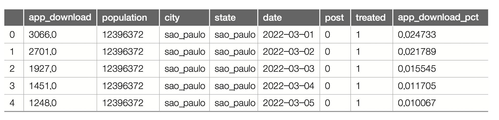
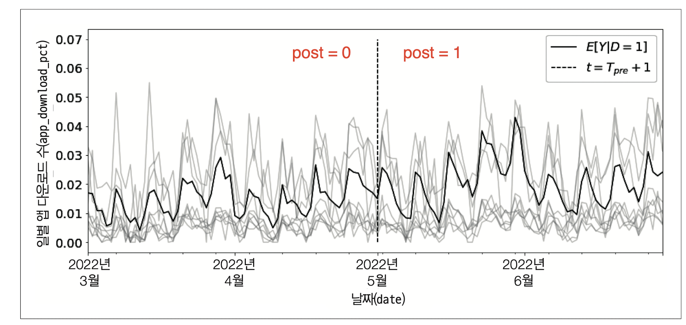
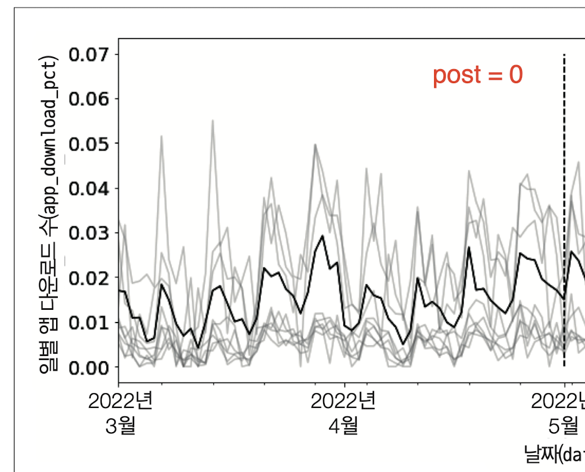
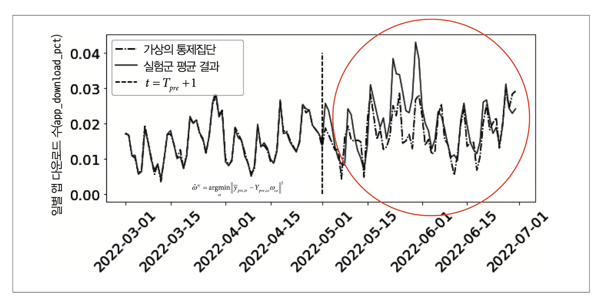
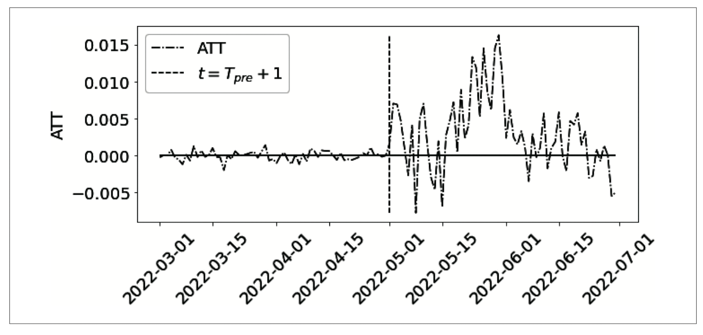
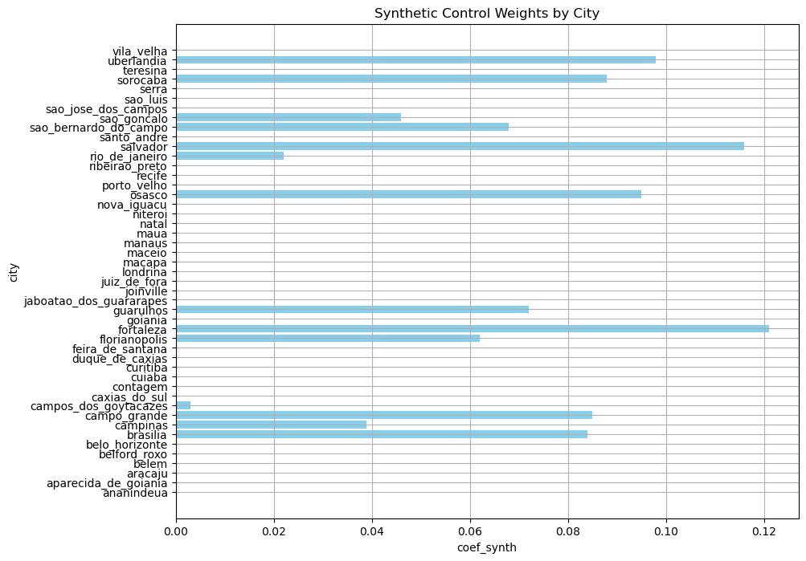
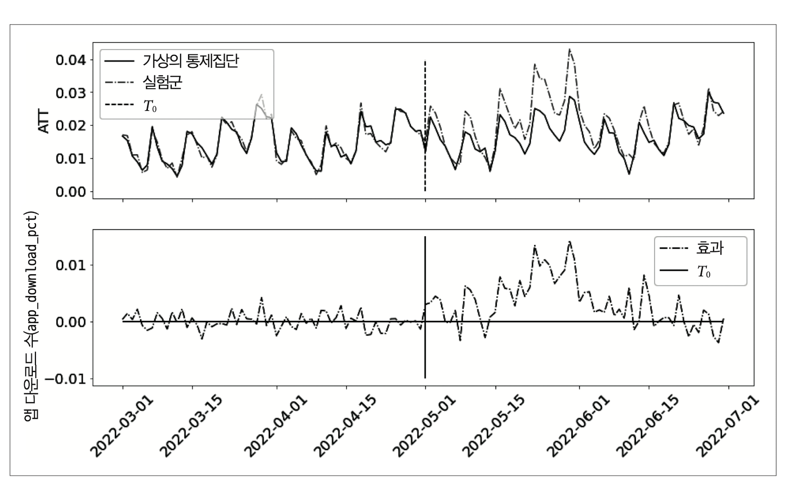

# Chapter 9.1 - 9.4 표준통제집단합성법

작성자: 김상돈

### 통제 집단 합성법이란?

- 가상의 통제 집단을 생성하여 인과 효과를 측정하는 방법
    - 처치가 없을 때의 시험군($E[Y_0|D = 1]$)과 비슷한 가상의 대조군(synthetic control)을 만드는 방법
- 패널 데이터 분석에 널리 활용됨

예제를 통해 문제를 다시 이해해보겠습니다. 

온라인 마케팅 데이터셋 

- app_download($Y)$ : 일별 앱 다운로드 수
- treated($D)$ : 마케팅 캠페인 집행 여부
- city : 도시
- Population : 도시의 인구
- state : 주(보조 정보)
- post : 개입 여부($I(t > T_{pre})$ )



데이터에 대한 특이 사항으로  treated ==1인 도시는 3개, treated ==0인 도시는 47개로 불균형합니다. 

각 도시별 일별 앱 다운로드 수의 시계열 추이를 시각화해보겠습니다.  treated ==1인 도시는 3개의 평균 결과($E[Y|D = 1]$)은 진한 선이고, 나머지 47개 도시는 연한 회색 선입니다. 5월 1일이 개입을 구분하는 시점입니다. 



$E[Y|D = 1]$는 증가하는 형태를 보입니다. 단순 추세가 아닌 인과 효과를 계산하기 위해 ATT를 추정해보겠습니다. 

$$
ATT = E[Y \mid D=1, \, \text{Post}=1] - E[Y_0 \mid D=1, \, \text{Post}=1]
$$

$ATT$를 계산하기 위해서, $E[Y \mid D=1, \, \text{Post}=1]$는 구할 수 있지만, $E[Y_0 \mid D=1, \, \text{Post}=1]$는 구할 수 없습니다. 따라서 과거의 정보를 이용하여 $E[Y_0 \mid D=1, \, \text{Post}=1]$를 정확히 추정해야 합니다. 

이 때 활용할 수 있는 방법이 통제집단합성법입니다. 

## 이중 차분법과 통제집단합성법 비교

|  | Difference-in-Differences (DID) | Synthetic Control Method |
| --- | --- | --- |
| 가정 | 평행 트렌드 가정, 처치에 대한 비기대 가정, 파급효과 없음 | 처치에 대한 비기대 가정, 파급효과 없음  |
| 장점 | 단순성과 직관적인 활용 | 맞춤형 통제 집단, 평행 트렌드 가정 불필요 |
| 단점 | 평행 트렌드 가정의 민감성, 외생적 사건의 영향 | 복잡성, 데이터 요구 |
| 적용 시기 | 평행 트렌드 가정 만족시 | 처리 집단과 통제 집단의 경향이 명확히 다를 때 |

## 가상의 통제집단과 수평 회귀

통제집단합성법은 개입 이전 기간 정보를 활용하여 모형을 적합한 후, $E[Y_0|D = 1]$을 추정하는 것입니다. 즉, 해당 문제를 아래 아래 수식으로 정의할 수 있습니다. 

개입 이전 시점의 정보를 활용하여 가중치를 구합니다. 

$$
\hat{\omega}^{sc} = \arg\min_{\omega} \left\| \bar{Y}_{pre,tr} - Y_{pre,co} \omega_{co} \right\|^2
$$

$\hat{\omega}^{sc}$를 구하고, 개입 이후 시점의 결과($Y_{post, co}$)를 곱하면  $E[Y_0|D = 1, Post = 1]$를 추정할 수 있습니다. 수식의 꼴이 선형회귀모형에서 회귀계수를 구하는 수식과 유사하죠? 예시를 위해 선형회귀모형을 통해 통제집단합성법을 이해해보겠습니다. 

y_pre_co : 5월 1일 이전 시점의 treat ==0인 47개 주의 일별 앱 다운로드 수 

y_pre_tr : 5월 1일 이전 시점의 treat ==1인 3개 주의 일별 앱 다운로드 수 평균 



개입 이전 시점의 정보를 활용하여 선형회귀모형을 적합하겠습니다. 

```python
from sklearn.linear_model import LinearRegression

model = LinearRegression(fit_intercept=False)
model.fit(y_pre_co, y_pre_tr.mean(axis=1))
# extract the weights
weights_lr = model.coef_
weights_lr.round(3)

array([-0.65 , -0.058, -0.239,  0.971,  0.03 , -0.204,  0.007,  0.095,
        0.102,  0.106,  0.074,  0.079,  0.032, -0.5  , -0.041, -0.154,
       -0.014,  0.132,  0.115,  0.094,  0.151, -0.058, -0.353,  0.049,
       -0.476, -0.11 ,  0.158, -0.002,  0.036, -0.129, -0.066,  0.024,
       -0.047,  0.089, -0.057,  0.429,  0.23 , -0.086,  0.098,  0.351,
       -0.128,  0.128, -0.205,  0.088,  0.147,  0.555,  0.229])
```

개입 이전 정보를 활용하여 $\hat{\omega}^{sc}$를 구했으므로, 5월 1일 이후 시점(post = 1)의 $E[Y_0|D = 1, Post = 1]$를 추정할 수 있습니다. Post = 0, Post =1인 전체 시점의 시계열 추이를 그리면 다음과 같습니다. 



그림을 통해 보면 대체로 $E[Y \mid D=1, \, \text{Post}=1] > \hat{E}[Y_0 \mid D=1, \, \text{Post}=1]$이므로, 온라인 마케팅 캠페인은 긍정적인 효과를 가져왔음을 알 수 있습니다. ATT 추정 결과를 시각화해보겠습니다. 



효과가 점진적으로 증가하다가, 점차 감소하는 것을 확인할 수 있습니다. 광고 효과가 나타나기까지 시간이 걸리므로 이러한 점진적 증가가 종종 관측됩니다. 마케팅에서는 novelty effect라고 표현합니다. 

개입 이전 시점의 잔차가 매우 작은 것을 확인할 수 있습니다. 이는 선형회귀모형의 과적합이 의심되며, $\hat{E}[Y \mid D=1, \, \text{Post}=1] > \hat{E}[Y_0 \mid D=1, \, \text{Post}=1]$ 결과를 신뢰할 수 없게 됩니다. 

보통 통제집단합성법에서는 단순한 선형회귀모형보다는 제약조건을 추가하여 활용합니다. 

## 표준 가상의 통제집단

표준 가상의 통제집단 공식은 다음과 같은 제약 조건을 추가합니다. 

$$
\hat{\omega}^{sc} = \arg\min_{\omega} \left\| \bar{Y}_{pre,tr} - Y_{pre,co} \omega_{co} \right\|^2 \\\text{s.t.} \quad \sum_i \omega_i = 1 \quad \text{and} \quad \omega_i > 0 \quad \forall i
$$

- QP programming
    
    원래의 QP 문제를 다음과 같이 변환할 수 있습니다:
    
    $$
    \hat{\omega}^{sc} = \arg\min_{\omega} \left\| \bar{Y}{pre,tr} - Y{pre,co} \omega_{co} \right\|^2
    $$
    
    제약 조건:
    
    $$
    
    C\omega = d \quad \text{where} \quad C = [1, 1, \ldots, 1], \quad d = 1
    \\
    
    A\omega \leq b \quad \text{where} \quad A = -I, \quad b = 0
    
    $$
    
    따라서, 최종 형태는 다음과 같습니다:
    
    $$
    \hat{\omega}^{sc} = \arg\min_{\omega} \left\| \bar{Y}{pre,tr} - Y{pre,co} \omega_{co} \right\|^2 \quad \text{s.t.} \quad C\omega = d \quad \text{and} \quad A\omega \leq b
    
    $$
    
    이 형태는 일반적인 Quadratic Programming 문제의 형태를 충족합니다.
    

제약 조건을 추가하는 이유는 첫 번째로, 외삽을 방지함으로써 **과적합을 방지**합니다(아래 그림 참고). 

](../pics/Chapter9_1_6.png)

[https://causalinferencelab.github.io/Causal-Inference-with-Python/15-Synthetic-Control.html](https://causalinferencelab.github.io/Causal-Inference-with-Python/15-Synthetic-Control.html)

예를 들어, control 1에는 가중치 2.25를 곱하고, control 2에는 가중치 -2를 곱한다고 해보겠습니다. control 2의 경우 음수 가중치를 곱하게 되므로, 매출(sales), 가격(price)는 음수가 됩니다. 매출과 가격은 음수가 될 수 없으므로, 의미 없는 데이터의 영역을 추정하게 됩니다. 

두 번째로, 해석 가능성입니다. 

제약 조건 1: $\sum_i \omega_i = 1$  

제약 조건 2 : $\omega_i >0$

제약 조건을 설정할 경우 $\hat{E}[Y \mid D=1, \, \text{Post}=1] > \hat{E}[Y_0 \mid D=1, \, \text{Post}=1]$를 추정하는데 중요하지 않은 가중치 대부분은 0이 됩니다. 또한, 가중치의 합이 1이므로, 가상의 통제집단을 생성하는데 필요한 각 단위들의 기여도 관점에서 해석해볼 수 있습니다. 

 



제약식이 존재하는 QP 프로그래밍이므로, 파이썬에 구현된 최적화 패키지인 cvxpy를 활용하여 $\hat{\omega}^{sc}$ 를 구해보겠습니다.  

```python
model = SyntheticControl()
model.fit(y_pre_co, y_pre_tr.mean(axis=1))

# extrac the weights
model.w_.round(3)
array([-0.   , -0.   ,  0.   , -0.   , -0.   , -0.   ,  0.084,  0.039,
        0.085,  0.003, -0.   , -0.   , -0.   , -0.   , -0.   ,  0.   ,
        0.062,  0.121, -0.   ,  0.072, -0.   ,  0.   , -0.   ,  0.   ,
       -0.   , -0.   ,  0.   , -0.   , -0.   ,  0.   , -0.   ,  0.095,
        0.   , -0.   ,  0.   ,  0.022,  0.116, -0.   ,  0.068,  0.046,
       -0.   , -0.   , -0.   ,  0.088,  0.   ,  0.098, -0.   ])
```

가중치 $\hat{\omega}^{sc}$는 모두 0 이상인 것을 확인할 수 있습니다. 가중치를 구했으므로, $\hat{E}[Y \mid D=1, \, \text{Post}=1] > \hat{E}[Y_0 \mid D=1, \, \text{Post}=1]$와 ATT를 시각화해보겠습니다. 



ATT의 경우 제약식이 없는 선형회귀모형을 적합했을 때에 비해 개입 전 모델의 잔차는 커졌지만, ATT는 추세는 이전과 비슷하지만 잡음이 줄어든 것을 확인할 수 있습니다. 즉, 과적합을 방지함으로써 일반화 성능이 더 높아진 것을 확인할 수 있습니다.